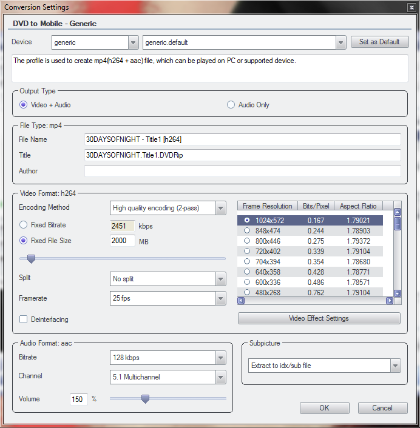

I often hear praise for software applications such as HandBrake and DVDShrink, but after using them myself in the past I found myself wanting a simpler solution. I didn’t really see why in this day-and-age ripping a movie to your hard drive should take more than a few clicks. Then I found DVDFab...

<!-- end -->

I should point out that DVDFab is not free software however it is very reasonably priced and even  comes with a very generous unlimited trial which lasts for 30 days if I remember correctly.

I’ve found that a lot of solutions in the past do DVD ripping very well but are often convoluted processes that take quite a lot of tweaking to get right. I enjoyed using Handbrake but that didn’t work very well with movies which used encryption. After much hunting on the internet I came across DVDFab, which can silently rip encrypted DVD’s and allows you to rip your DVD in as little as 2 clicks (and one of those is opening the program).

Here is how you do it:

## 1 - Download and install DVDFab

You can download the free trial from [http://www.dvdfab.com/en/download.htm](http://www.dvdfab.com/en/download.htm)

## 2 - Open DVDFab

When you first open DVDFab you will notice it has a lot of options on the side. The one we are interested in is ‘DVD-to-Mobile -> Generic’.

3 - Insert the DVD you wish to rip

Once you have selected the correct profile, insert your DVD and it will immediately scan it and select the title it believes is the movie (I’ve ripped about 60 films with DVDRip so far and it only got it wrong on T2: Ultimate Edition) this is usually the longest track on the Disc. If you are ripping a TV Series or something else, you can manually select other tracks.

Note: When you first insert a DVD it will ask you to select a region, and if you only ever use DVD’s from one region you can ask it not to show this again.

## 4 – Set the configuration you wish to use

This is the hardest part but it is still very easy. When your disc has been scanned in, make sure that ‘generic’ is set on the profile section at the bottom and click on ‘edit’ (just above the start button). Then simply make sure everything in that box matches everything in the screenshot below.

Of course the settings are all about personal preference. I want my movies to be really good quality rips so I set everything quite high. This creates a 2 GB file per movie and takes an average of 3 hours for a 90 minute movie.

Changing the encoding method to 1-pass and altering the audio format will cut that time down quite significantly.

_Note: The frame resolution varies on each DVD. I just always select the highest result._

Once this is done, click ‘Ok’

## 5 – Rip the DVD

Once you are back to the main screen, hit ‘start’ and you can just leave the program to do its thing. The best part of all this is that from now on you are all configured. When you insert the disc in future you can just immediately hit ‘start’ and it will rip your DVD exactly as you want it.

## Bonus Round – Rip Blu Rays

The latest release of DVDFab even has the ability to rip Blu-Ray DVD’s, I have not actually tried this yet as I don’t own any Blu-rays yet, but plan to buy one in the next few weeks and update this tutorial with the details.

Happy ripping!
